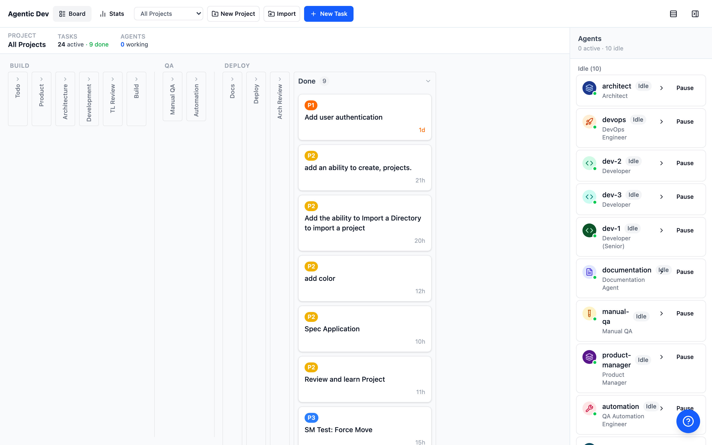
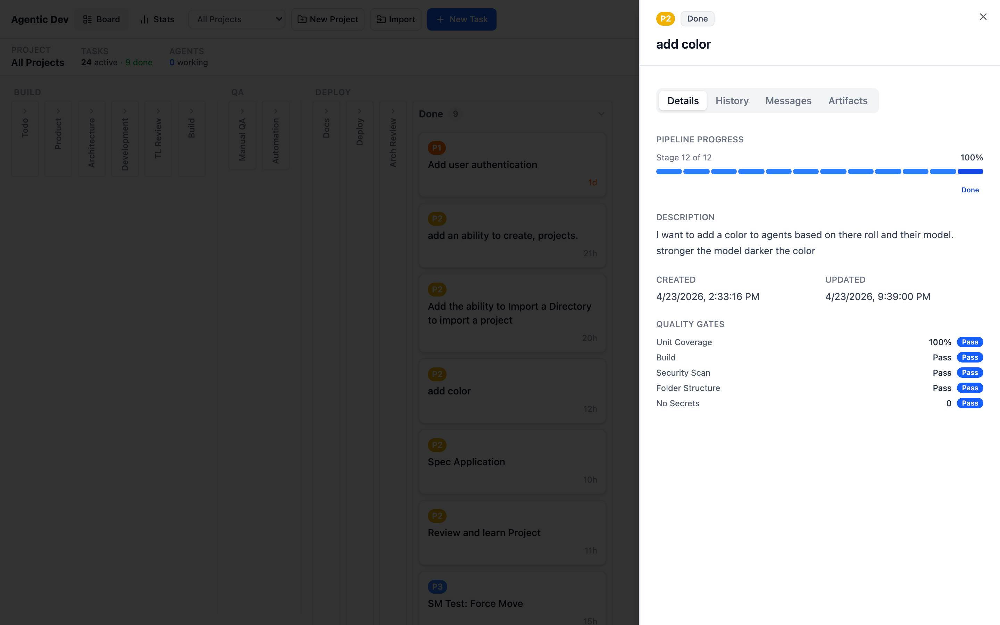
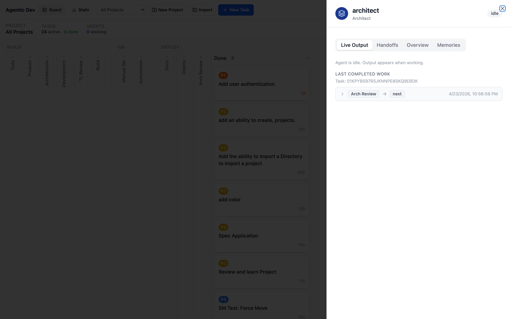
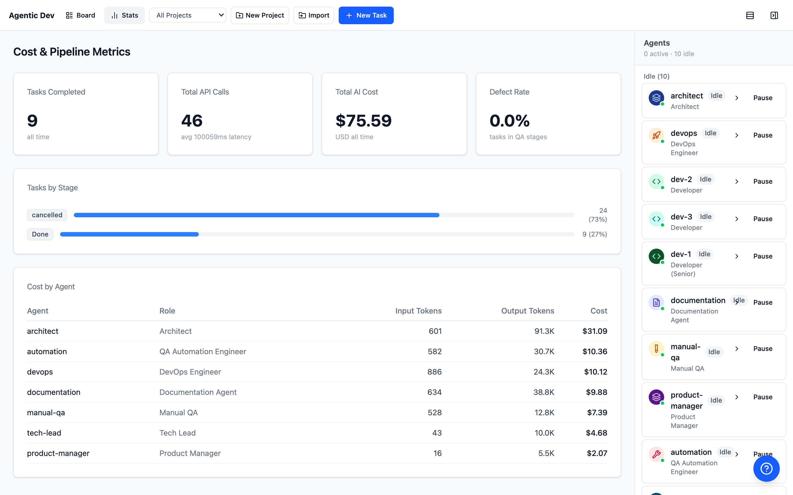
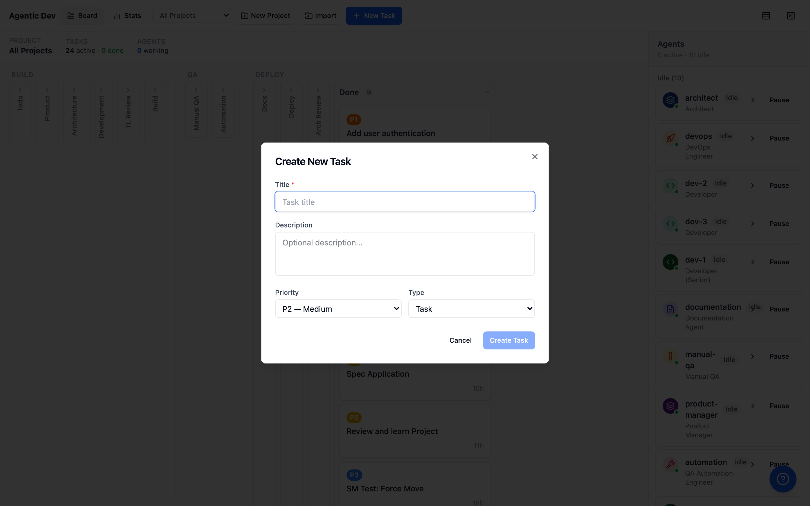

# Agentic Dev

A multi-agent software development system that orchestrates 10 AI agents through a 12-stage SDLC pipeline. Create a task, and a team of specialized agents — product manager, architect, developers, tech lead, DevOps, QA, and documentation — collaboratively build it from spec to deployment.



## How It Works

You create a task (feature, bug fix, or spec) and assign it to a project. The orchestrator dispatches it through the pipeline:

```
Todo -> Product -> Architecture -> Development -> Tech Lead Review ->
DevOps Build -> Manual QA -> Automation -> Documentation ->
DevOps Deploy -> Arch Review -> Done
```

Each stage is handled by a specialized agent. Agents hand off work to each other with structured handoff documents. Quality gates at each transition enforce standards before advancing.

## The Agents

| Agent | Model | Stages | Role |
|-------|-------|--------|------|
| Product Manager | Opus | product | Writes PRDs, acceptance criteria |
| Architect | Opus | architecture, arch_review | System design, ADRs, final review |
| Tech Lead | Opus | tech_lead_review | Code review, approval |
| Dev 1 (Senior) | Opus | development | Implementation |
| Dev 2 | Sonnet | development | Implementation |
| Dev 3 | Sonnet | development | Implementation |
| DevOps | Sonnet | devops_build, devops_deploy | CI/CD, deployment |
| Manual QA | Sonnet | manual_qa | Manual testing |
| Automation | Sonnet | automation | Test automation |
| Documentation | Sonnet | documentation | Docs, guides |

## Screenshots

| Task Detail | Agent Detail |
|:-----------:|:------------:|
|  |  |

| Stats Dashboard | Create Task |
|:---------------:|:-----------:|
|  |  |

## Features

- **Kanban board UI** — Real-time task tracking across all 12 stages
- **Multi-project support** — Manage multiple codebases simultaneously
- **Quality gates** — Mandatory checks at each pipeline transition
- **Agent memory** — Persistent memory across tasks (decisions, patterns, preferences)
- **Inter-agent messaging** — Agents can clarify and reject work
- **Self-healing** — Automatic retry with exponential backoff for transient errors
- **Self-repair** — Spawns Opus to diagnose and fix code bugs after repeated failures
- **Watchdog** — Detects and recovers stuck tasks
- **Live output** — Stream agent activity via SSE
- **Cost tracking** — Per-agent and per-task API cost monitoring
- **Dual CLI backend** — Run agents via Claude Code or OpenCode

## Quick Start

### Prerequisites

- Node.js >= 20
- [Claude Code CLI](https://docs.anthropic.com/claude-code) or [OpenCode CLI](https://opencode.ai)
- Anthropic API key (if using Claude Code with API key auth)

### Install and Run

```bash
git clone https://github.com/shooter51/agentic-dev.git
cd agentic-dev
npm install
npm run build

# Start backend (from packages/backend)
cd packages/backend
npx tsx src/index.ts

# Start frontend (from packages/frontend, in another terminal)
cd packages/frontend
npx vite --host
```

The dashboard is at `http://localhost:5173` and the API at `http://localhost:3001`.

### Docker

```bash
docker build -t agentic-dev .
docker run -p 3001:3001 \
  -v agentic-data:/app/packages/backend/data \
  -e ANTHROPIC_API_KEY=your-key \
  agentic-dev
```

Or pull the pre-built image:

```bash
docker pull ghcr.io/shooter51/agentic-dev:latest
```

In Docker, the frontend and API are served on a single port (3001).

### Docker Compose

```bash
ANTHROPIC_API_KEY=your-key docker compose up
```

## Configuration

| Environment Variable | Default | Description |
|---------------------|---------|-------------|
| `PORT` | `3001` | API server port |
| `DB_PATH` | `data/agentic-dev.db` | SQLite database path |
| `ANTHROPIC_API_KEY` | — | Anthropic API key (or use CLI auth) |
| `AGENT_RUNNER` | `claude` | Agent CLI backend: `claude` or `opencode` |
| `CLAUDE_BIN` | `claude` | Path to Claude Code binary |
| `OPENCODE_BIN` | `opencode` | Path to OpenCode binary |
| `OPENCODE_OPUS_MODEL` | `anthropic/claude-opus-4-20250514` | Opus model for OpenCode |
| `OPENCODE_SONNET_MODEL` | `anthropic/claude-sonnet-4-20250514` | Sonnet model for OpenCode |

## Architecture

```
agentic-dev/
  packages/
    shared/          # Shared TypeScript types (AgentIdentity, TaskStage, etc.)
    backend/         # Fastify API + orchestrator + pipeline engine
    frontend/        # React dashboard (Vite + Tailwind + shadcn/ui)
  docs/
    adr/             # Architecture Decision Records (11 ADRs)
    lld/             # Low-Level Design documents (9 LLDs)
  e2e/               # Playwright end-to-end tests
  Dockerfile         # Multi-stage build with Claude Code + OpenCode
  docker-compose.yml
```

### Backend (`packages/backend`)

- **Fastify v5** REST API with SSE for real-time updates
- **SQLite** via better-sqlite3 + Drizzle ORM
- **Orchestrator** — Dispatch loop, concurrency semaphore, agent lifecycle
- **Pipeline FSM** — 12-stage state machine with quality guards
- **CLI Runner** — Spawns Claude Code or OpenCode subprocesses per agent
- **Self-healing** — Error classification, retry, failover, self-repair
- **Memory system** — Per-agent namespaced memory with consolidation
- **Message bus** — Blocking inter-agent communication

### Frontend (`packages/frontend`)

- **React 19** with TypeScript
- **Vite 6** dev server with Tailwind CSS v4
- **TanStack Query** for server state (polling every 3s)
- **Zustand** for client state
- **dnd-kit** for drag-and-drop task movement
- **Radix UI** primitives (dialogs, tabs, scroll areas)
- Kanban board, agent panel, task detail, stats dashboard

### Pipeline Stages

```
todo ──> product ──> architecture ──> development ──> tech_lead_review ──>
devops_build ──> manual_qa ──> automation ──> documentation ──>
devops_deploy ──> arch_review ──> done
```

Each transition has a **quality guard** that checks metadata (acceptance criteria, test coverage, build status, etc.) before allowing advancement. Guards can be mandatory or advisory per-project.

### How Agents Run

1. Orchestrator finds a task ready for dispatch (correct stage, unassigned, no blocking defects)
2. Finds an idle agent in the matching lane
3. Builds a system prompt + task prompt with context (handoffs, memories, CLAUDE.md)
4. Spawns `claude -p "prompt" --output-format stream-json` (or `opencode run --format json`)
5. Streams stdout for tool calls (emitted as SSE) and the final result
6. On completion, auto-sets quality gate metadata and advances the pipeline
7. Next agent picks up the task in its new stage

## API

### Tasks
- `GET /api/projects/:id/board` — Kanban board (tasks grouped by stage)
- `POST /api/projects/:id/tasks` — Create task
- `GET /api/tasks/:id` — Task detail
- `PATCH /api/tasks/:id` — Update task
- `POST /api/tasks/:id/move` — Force-move to stage
- `POST /api/tasks/:id/cancel` — Cancel task
- `POST /api/tasks/:id/retry` — Retry stuck task
- `GET /api/tasks/:id/history` — Stage transition history
- `GET /api/tasks/:id/handoffs` — Handoff documents

### Agents
- `GET /api/agents` — List all agents with status
- `POST /api/agents/:id/pause` — Pause agent
- `POST /api/agents/:id/resume` — Resume agent

### Projects
- `GET /api/projects` — List projects
- `POST /api/projects` — Create project
- `POST /api/projects/import` — Import from directory

### Stats
- `GET /api/stats/costs` — Cost breakdown per agent
- `GET /api/stats/pipeline` — Pipeline throughput metrics

### Real-time
- `GET /api/events` — SSE stream (agent status, task updates, tool calls)

## Testing

```bash
# Backend unit tests
cd packages/backend && npm test

# Frontend unit tests
cd packages/frontend && npm test

# E2E tests (requires backend + frontend running)
npx playwright test
```

43 Playwright E2E tests covering the state machine, UI, and API.

## Documentation

- [Product Requirements](docs/PRD.md)
- [Architecture Decision Records](docs/adr/) (11 ADRs)
- [Low-Level Designs](docs/lld/) (9 LLDs)
- [Recommended Practices](docs/recommended-practices.md)

## License

[MIT](LICENSE)
